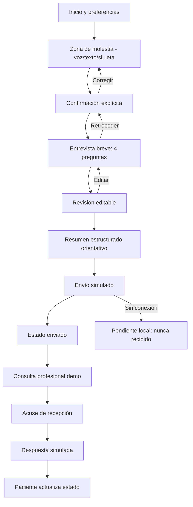

# Navegación e interacciones entre pantallas

```mermaid
flowchart TD
 A[Inicio y preferencias] --> B[Zona de molestia - voz/texto/silueta]
 B --> C[Confirmación explícita]
 C --> D[Entrevista breve: 4 preguntas]
 D --> E[Revisión editable]
 E --> F[Resumen estructurado orientativo]
 F --> G[Envío simulado]
 G --> H[Estado enviado]
 H --> I[Consulta profesional demo]
 I --> J[Acuse de recepción]
 J --> K[Respuesta simulada]
 K --> L[Paciente actualiza estado]
 C -->|Corregir| B
 D -->|Retroceder| C
 E -->|Editar| D
 G -->|Sin conexión| M[Pendiente local: nunca recibido]
```

El resumen separa la declaración del paciente del texto automático, y no hay decisiones clínicas automáticas.
